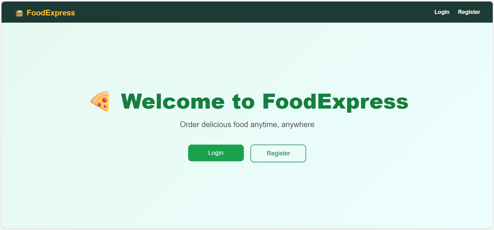
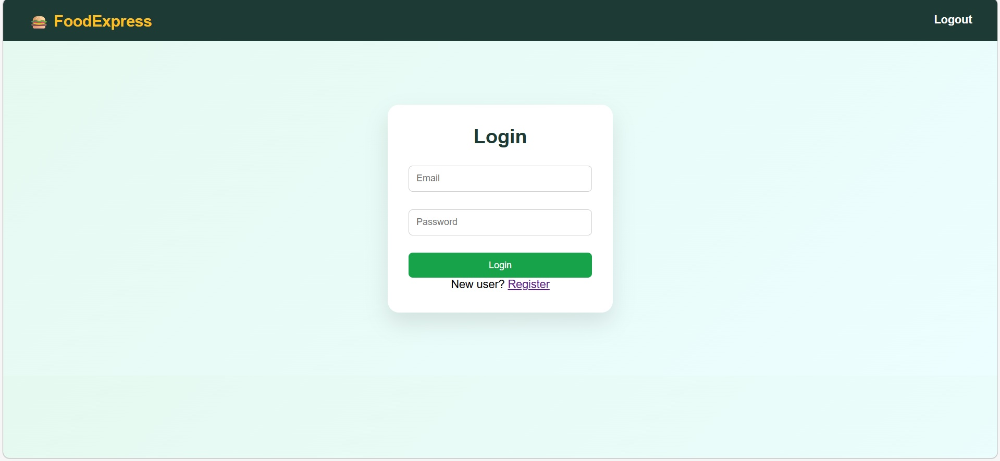
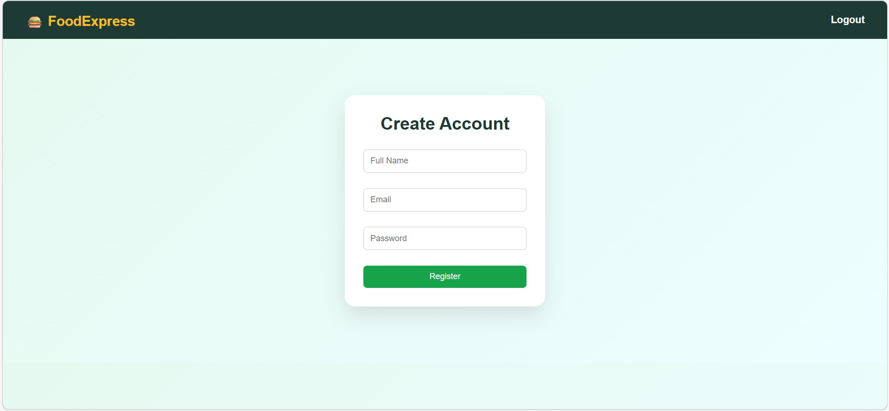

# 🍔 FoodExpress

### Responsive Food Ordering Web Application

FoodExpress is a **responsive frontend food ordering web application** built with **HTML5, CSS3, and JavaScript**. It provides a complete client-side shopping experience with user login and registration interfaces, a food catalog, shopping cart management, form validation, and browser-based data persistence using `localStorage`.

The project demonstrates practical frontend development concepts including responsive layouts, DOM manipulation, client-side validation, and dynamic cart functionality.

---

## 🌐 Live Demo

**[FoodExpress – Live Application](https://food-express-one-brown.vercel.app/)**

---

## ✨ Features

### 👤 User Interface

* Responsive home page
* Login interface
* User registration interface
* Food catalog
* Food item cards with images and prices
* Responsive navigation

### 🛒 Shopping Cart

* Add products to cart
* Increase or decrease product quantity
* Remove products from cart
* Dynamic total price calculation
* Cart data persistence using `localStorage`

### ✅ Client-Side Functionality

* Form validation
* DOM manipulation
* Dynamic content updates
* Responsive design
* Interactive buttons and navigation

---

## 🛠️ Tech Stack

| Technology   | Purpose                            |
| ------------ | ---------------------------------- |
| HTML5        | Page structure and content         |
| CSS3         | Styling and responsive layouts     |
| JavaScript   | Application logic and interactions |
| localStorage | Client-side cart data persistence  |
| Vercel       | Frontend deployment                |
| Git & GitHub | Version control                    |

---

## 🏗️ Application Flow

```text
                    ┌─────────────────────┐
                    │        User         │
                    └──────────┬──────────┘
                               │
                               ▼
                    ┌─────────────────────┐
                    │     FoodExpress     │
                    │    Web Interface    │
                    └──────────┬──────────┘
                               │
             ┌─────────────────┼─────────────────┐
             ▼                 ▼                 ▼
       ┌───────────┐     ┌───────────┐     ┌───────────┐
       │   Login   │     │  Catalog  │     │ Register  │
       └───────────┘     └─────┬─────┘     └───────────┘
                               │
                               ▼
                       ┌───────────────┐
                       │  Add to Cart  │
                       └───────┬───────┘
                               │
                               ▼
                       ┌───────────────┐
                       │ Shopping Cart │
                       │   & Totals    │
                       └───────┬───────┘
                               │
                               ▼
                       ┌───────────────┐
                       │  localStorage │
                       └───────────────┘
```

---

## 📂 Project Structure

```text
FoodExpress/
│
├── images/
│   └── food/
│       ├── biryani.jpg
│       ├── pizza.jpg
│       ├── pasta.jpg
│       ├── noodles.jpg
│       └── ...
│
├── screenshots/
│   ├── homepage3.jpg
│   ├── loginpage3.jpg
│   ├── registerpage3.jpg
│   ├── menu page3.1.jpg
│   ├── menu page3.2.jpg
│   └── cart page3.jpg
│
├── index.html
├── login.html
├── register.html
├── catalog.html
├── cart.html
├── style.css
├── script.js
├── WAD WEEK3 DOCUMENTATION.pdf
├── LICENSE
└── README.md
```

---

## 📄 Application Pages

### 🏠 Home Page — `index.html`

* Provides the main landing page
* Displays navigation options
* Provides access to login and registration
* Uses a responsive layout

### 🔐 Login Page — `login.html`

* Provides email and password fields
* Performs client-side validation
* Uses a responsive form layout

### 📝 Registration Page — `register.html`

* Allows users to enter registration details
* Performs client-side input validation
* Provides a responsive registration interface

### 🍕 Food Catalog — `catalog.html`

* Displays available food items
* Shows product images and prices
* Uses a responsive grid layout
* Provides Add to Cart functionality

### 🛒 Shopping Cart — `cart.html`

* Displays selected food items
* Supports quantity management
* Calculates the total price dynamically
* Provides checkout interface

### 🎨 Styling — `style.css`

* Defines the visual design of the application
* Provides responsive layouts
* Styles navigation, cards, buttons, forms, and other UI elements

### ⚙️ JavaScript — `script.js`

* Handles cart operations
* Updates product quantities
* Calculates total prices
* Uses `localStorage` for cart persistence
* Performs client-side form validation
* Handles dynamic UI interactions

---

## 📸 Screenshots

### 🏠 Home Page



### 🔐 Login Page



### 📝 Registration Page



### 🍕 Food Catalog


### 🛒 Shopping Cart


---

## 💾 Data Storage

FoodExpress uses the browser's **localStorage** for client-side cart persistence.

This allows the application to:

* Store selected food items
* Preserve cart quantities
* Retrieve cart data between page interactions
* Update cart contents dynamically

No external database is required for the current frontend implementation.

---

## 🚀 Future Enhancements

* Backend REST API integration
* Database integration
* Secure server-side authentication
* Online payment integration
* Order tracking
* Restaurant/vendor management
* User order history
* Backend-based user accounts

---

## 📚 Learning Outcomes

This project provided practical experience with:

* HTML5 semantic structure
* CSS3 responsive design
* JavaScript fundamentals
* DOM manipulation
* Client-side form validation
* Browser `localStorage`
* Dynamic shopping cart implementation
* Responsive UI development
* Frontend project organization
* Git and GitHub workflow
* Vercel deployment

---

## 📜 License

This project is licensed under the **MIT License**.

See the [`LICENSE`](LICENSE) file for details.

---

## 👩‍💻 Author

**Akshitha Gasikanti**

B.Tech Information Technology Student
Aspiring Software Engineer

GitHub: [Akshitha363](https://github.com/Akshitha363)
